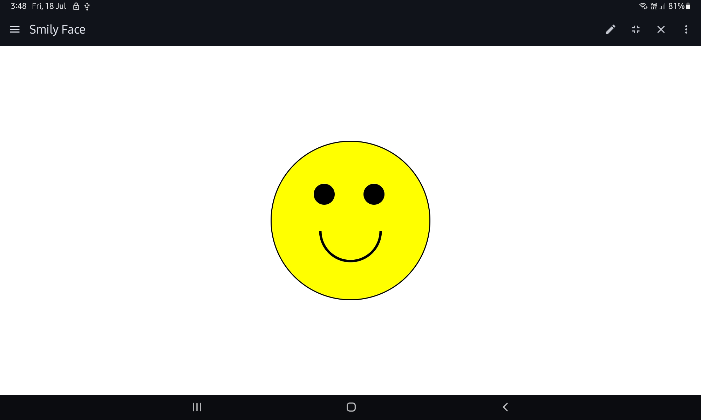

# 😊 Smiley Face — HTML & CSS Project

This is my first front-end project, where I created a simple smiley face using only HTML and CSS.

## 🔧 Built With

- HTML5
- CSS3

## 📁 Files

- `index.html` – Structure of the face
- `style.css` – Styling and design

## 🌐 Live Preview

Check it live here:  
👉 html file : ( https://github.com/Ankit-Raj902/myfirstrepo/blob/f42cef7233e0bfc68b80e0c3d44d5a281f5644b9/index1.html )   
👉 css file : ( https://github.com/Ankit-Raj902/myfirstrepo/blob/f42cef7233e0bfc68b80e0c3d44d5a281f5644b9/style1.css )

## 📸 Screenshot

 <!-- optional -->

## 🧑‍💻 Author

- **Ankit**
